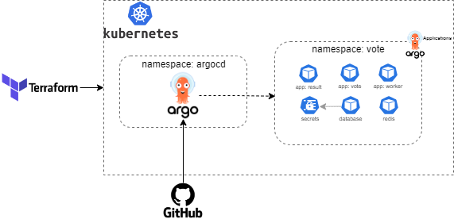

## Laboratório Terraform + ArgoCD

> Este laboratório foi realizado para ministrar a disciplina de Cultura e Práticas DevOps (PucMinas).

Deploy de uma aplicação distribuida em múltiplos container Docker no cluster kubernetes.

O exemplo de aplicação em microsserviços utilizado no laboratório pode ser baixado no link (https://github.com/dockersamples/example-voting-app).



A arquitetura consiste no deploy e criação das aplicações do ArgoCD para cada microsserviço utilizando infraestrutura como código (Terraform). 

---

Executar scripts Terraform

```sh
$ cd infrastructure/cluster

$ terraform init

$ terraform apply

$ cd infrastructure/k8s

$ terraform init

$ terraform apply
```

---

### Para acessar o ArgoCD via port-forward e criar o segredo para conexão com o repositório privado no github.

```sh
# Port-forward
kubectl port-forward svc/argocd-server -n argocd 8080:443

# Create secret
kubectl create secret generic ssh-private-secret --from-file=sshPrivateKey=/home/<user>/.ssh/id_rsa -n argocd
```


